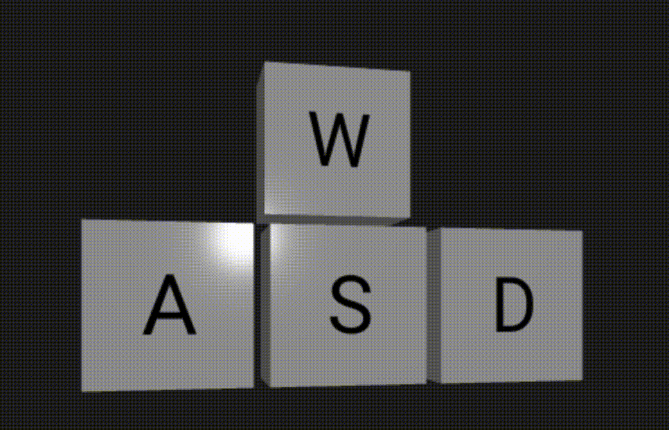

# use-wasd



a super easy react hook to check which keys are currently pressed on your keyboard

```bash
npm install use-wasd
```

This hook returns an object containing the keys that have been pressed and if they are currently pressed

```js
import useWASD from "use-wasd";

export default function KeysPressed() {
  // You can initialize, or you just leave it empty
  const keyboard = useWASD({ w: false, a: false, s: false, d: false });

  return (
    <>
      <h2>Keys pressed</h2>
      {Object.keys(keyboard).map((key) => {
        return (
          <span key={key} style={{ margin: "10px" }}>
            {key}: {keyboard[key] ? "true" : "false"}
          </span>
        );
      })}
    </>
  );
}
```

[Some examples](https://codesandbox.io/s/usewasd-hook-jwvks5?file=/src/App.js)

[r3f example](https://codesandbox.io/s/use-wasd-hook-in-r3f-s0pomg?file=/src/App.js)
